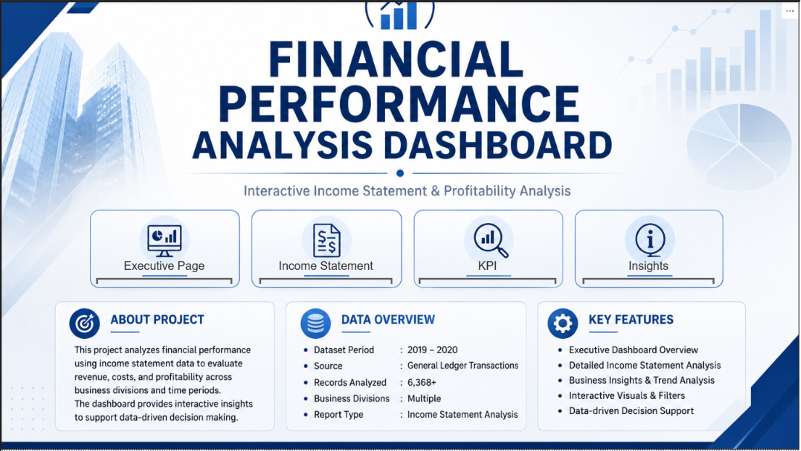
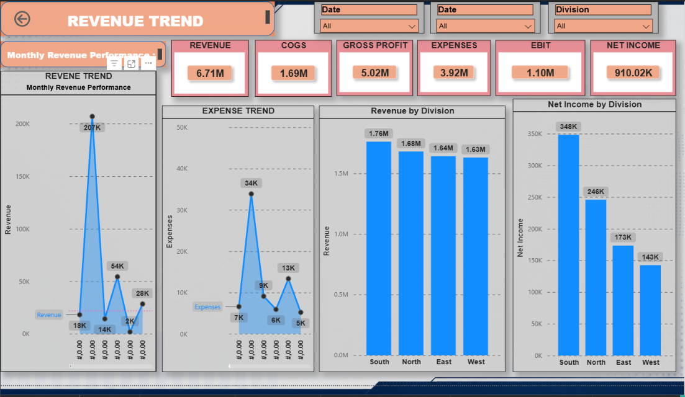
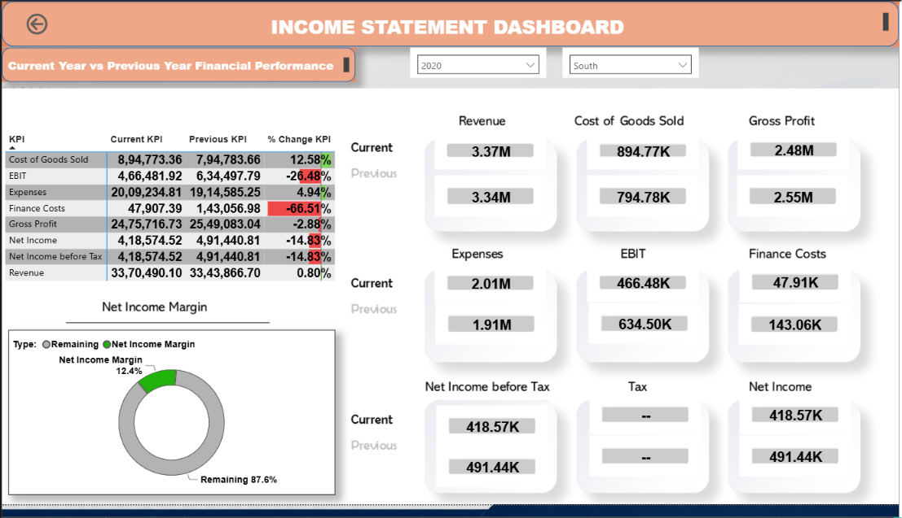
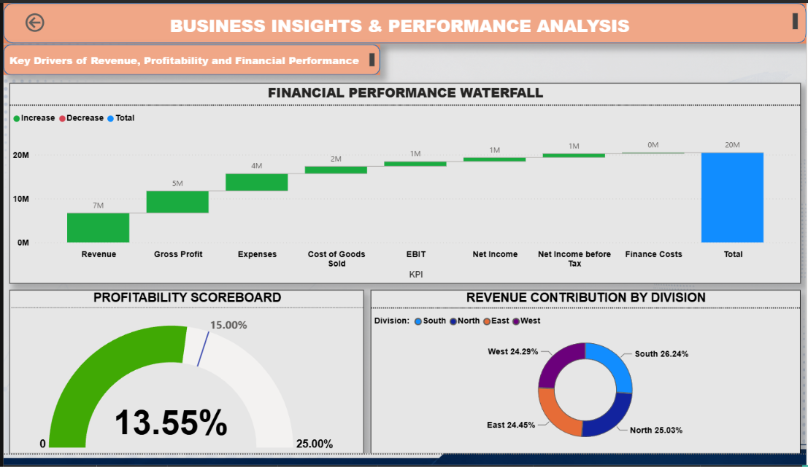
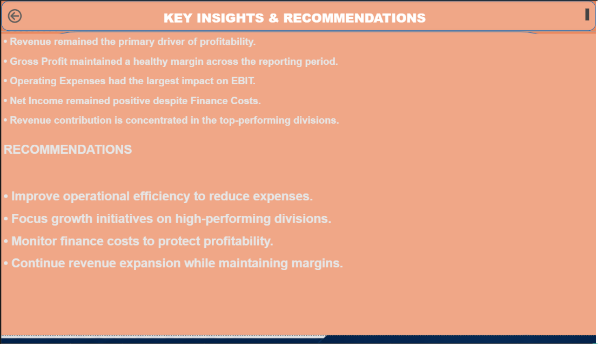

# 📊 Income Statement Analysis Dashboard | Power BI

An interactive Power BI dashboard developed to analyze financial performance using Income Statement data. The dashboard provides insights into revenue, profitability, expenses, and key financial indicators to support business decision-making.

---

# 📌 Project Overview

This project analyzes financial performance using Income Statement data from multiple business divisions.

The dashboard transforms raw financial transactions into interactive visual reports that help management evaluate profitability, monitor business performance, compare financial metrics across periods, and identify opportunities for operational improvement.

---

# 🎯 Business Objectives

- Analyze company financial performance.
- Compare current year vs previous year financial metrics.
- Monitor profitability across business divisions.
- Identify revenue and expense trends.
- Evaluate key financial KPIs.
- Generate actionable business insights.
- Support data-driven financial decision making.

---

# 📂 Dataset Information

**Dataset:** General Ledger Transactions

**Report Period:** 2019–2020

**Records Analyzed:** 6,368+

**Source:** Income Statement Financial Dataset

---

# 📸 Dashboard Preview

## Introduction



## Executive Dashboard



## Income Statement Dashboard



## Business Insights Dashboard



## Recommendations



---

# 📑 Dashboard Components

## 🏠 1. Introduction Page


The introduction page provides an overview of the project, explains the business objective, dataset information, and allows users to navigate through different dashboard pages.

### Purpose

- Introduce the financial analysis project.
- Present project objectives.
- Summarize dataset information.
- Provide easy dashboard navigation.

---

## 📈 2. Executive Dashboard


The Executive Dashboard provides a high-level summary of the company's financial performance across business divisions.

### Business Questions Answered

- What is the total Revenue?
- What is the Gross Profit?
- What are the total Expenses?
- What is the EBIT?
- What is the Net Income?
- Which division generates the highest revenue?
- Which division contributes the highest net income?
- How has monthly revenue changed over time?
- How have operating expenses changed?

### Business Value

- Provides executives with an instant financial overview.
- Identifies top-performing divisions.
- Highlights revenue and expense trends.
- Supports strategic financial planning.

---

## 💰 3. Income Statement Dashboard


This dashboard compares Current Year and Previous Year financial performance while evaluating key profitability metrics.

### Business Questions Answered

- How has Revenue changed compared to the previous year?
- Has Gross Profit improved?
- How have Expenses changed?
- What is the percentage change in each KPI?
- Has EBIT increased or decreased?
- How has Net Income changed?
- What is the Net Income Margin?

### Business Value

- Tracks year-over-year financial performance.
- Measures operational efficiency.
- Helps management identify financial strengths and weaknesses.
- Supports budgeting and forecasting.

---

## 📊 4. Business Insights & KPI Analysis


This dashboard analyzes overall financial performance using KPI scorecards, waterfall charts, and profitability indicators.

### Business Questions Answered

- Which KPIs contribute most to profitability?
- How does Revenue contribute to overall financial performance?
- What is the Profitability Score?
- How is Revenue distributed across divisions?
- Which business divisions generate the greatest financial contribution?

### Business Value

- Identifies key profitability drivers.
- Supports executive decision-making.
- Highlights financial strengths and improvement opportunities.
- Simplifies financial reporting through interactive visuals.

---

## 💡 5. Key Insights & Recommendations


This page summarizes the overall findings from the analysis and provides strategic recommendations for business improvement.

### Key Findings

- Revenue remained the primary driver of profitability.
- Gross Profit maintained healthy margins.
- Operating Expenses had the largest impact on EBIT.
- Net Income remained positive despite Finance Costs.
- Revenue contribution is concentrated among top-performing divisions.

### Business Recommendations

- Improve operational efficiency to reduce expenses.
- Focus investment on high-performing divisions.
- Monitor finance costs regularly.
- Continue revenue growth while maintaining healthy profit margins.
- Strengthen financial planning using KPI monitoring.

---
# 📌 Key Performance Indicators (KPIs)

The dashboard tracks the following financial KPIs to evaluate overall business performance:

- Revenue
- Cost of Goods Sold (COGS)
- Gross Profit
- Operating Expenses
- EBIT (Earnings Before Interest & Taxes)
- Finance Costs
- Net Income Before Tax
- Net Income
- Net Income Margin
- Revenue by Division
- Net Income by Division
- Monthly Revenue Trend
- Monthly Expense Trend
- Profitability Score

---

# 📊 Business Questions Solved

This dashboard answers the following business questions:

- What is the company's total Revenue?
- How much Gross Profit was generated?
- What are the total Operating Expenses?
- What is the company's EBIT?
- What is the Net Income?
- How has financial performance changed compared to the previous year?
- Which KPI has improved the most?
- Which KPI requires management attention?
- Which business division generates the highest Revenue?
- Which division contributes the highest Net Income?
- How have Revenue and Expenses changed over time?
- What is the company's Net Income Margin?
- Which financial indicators contribute most to profitability?
- What strategic improvements can increase business performance?

---

# 💡 Key Business Insights

The analysis highlights several important financial insights:

- Revenue remained the largest contributor to overall profitability.
- Gross Profit maintained a healthy margin across the reporting period.
- Operating Expenses significantly influenced EBIT performance.
- Finance Costs reduced overall profitability and require continuous monitoring.
- Net Income remained positive despite increasing operational costs.
- Revenue generation is concentrated within the highest-performing business divisions.
- Current year performance shows areas of improvement as well as KPIs requiring corrective action.
- Financial KPI monitoring enables faster strategic decision-making.

---

# ⚙️ Power BI Features Used

This project demonstrates advanced Power BI reporting techniques.

### Data Preparation

- Power Query
- Data Cleaning
- Data Transformation
- Data Modeling

### Dashboard Features

- KPI Cards
- Interactive Slicers
- Navigation Buttons
- Dynamic Filters
- Waterfall Chart
- Donut Charts
- Gauge Chart
- Column Charts
- Line Charts
- Comparative KPI Analysis
- Conditional Formatting
- Executive Dashboard Design

### Business Intelligence

- Financial Reporting
- Profitability Analysis
- Trend Analysis
- Division Performance Analysis
- Executive Decision Support

---

# 🧮 DAX Measures Used

The dashboard uses DAX (Data Analysis Expressions) to calculate dynamic financial metrics.

Examples include:

- Total Revenue
- Total Cost of Goods Sold (COGS)
- Gross Profit
- Total Expenses
- EBIT
- Finance Costs
- Net Income Before Tax
- Net Income
- Net Income Margin
- Revenue by Division
- Current Year KPIs
- Previous Year KPIs
- KPI Percentage Change
- Profitability Score

> *Complete DAX calculations can be viewed in the Power BI (.pbix) file.*
---

# 💻 Technologies Used

This project was developed using the following technologies:

- Microsoft Power BI Desktop
- Power Query
- DAX (Data Analysis Expressions)
- Data Modeling
- Microsoft Excel
- Financial Data Analysis
- Business Intelligence
- Interactive Data Visualization

---

# 📂 Project Structure

```text
Income-Statement-Analysis-Dashboard-PowerBI/
│
├── README.md
├── LICENSE
├── Income_Statement_pro_Sol.pbix
│
├── dataset/
│   ├── README.md
│   ├── Income Statement Datasets.xlsx
│   └── Problem Statement (if available)
│
└── images/
    ├── README.md
    ├── 01_intro_page.png.png
    ├── 02_executive_dashboard.png.png
    ├── 03_income_statement.png.png
    ├── 04_business_insights_kpi_analysis.png.png
    └── 05_key_insights_recommendations.png.png
```

---

# 🚀 How to Use

1. Clone or download this repository.
2. Open **Income_Statement_pro_Sol.pbix** using Microsoft Power BI Desktop.
3. Refresh the dataset if required.
4. Navigate through the dashboard pages using the navigation buttons.
5. Apply slicers and filters to perform interactive financial analysis.
6. Review the Insights & Recommendations page for strategic business decisions.

---

# 🎯 Skills Demonstrated

## Technical Skills

- Power BI Dashboard Development
- Power Query
- Data Cleaning
- Data Transformation
- Data Modeling
- DAX Calculations
- KPI Design
- Financial Reporting
- Interactive Dashboard Development
- Business Intelligence
- Data Visualization

### Business Skills

- Financial Statement Analysis
- Income Statement Analysis
- Profitability Analysis
- Revenue Analysis
- Expense Analysis
- Trend Analysis
- Executive Reporting
- Decision Support
- Business Insight Generation
- Data Storytelling

---

# 📝 Conclusion

This project demonstrates how Microsoft Power BI can transform financial transaction data into an interactive executive reporting solution.

Using Power Query, DAX, KPI reporting, and advanced financial visualizations, the dashboard provides meaningful insights into revenue, profitability, operational expenses, and business performance.

The project showcases practical financial analytics, business intelligence reporting, and executive dashboard development skills that support strategic decision-making.

---

# ⭐ Project Highlights

- 📊 Executive Financial Dashboard
- 💰 Income Statement Analysis
- 📈 Revenue & Expense Trend Analysis
- 📉 Current Year vs Previous Year Comparison
- 📌 Financial KPI Monitoring
- 📊 Profitability Analysis
- 💡 Business Insights & Recommendations
- ⚡ Interactive Power BI Dashboard
- 🧮 DAX-Based Financial Calculations

---

# 📬 Connect With Me

## GitHub

**Viraj Waikar**

https://github.com/Viraj088889999
